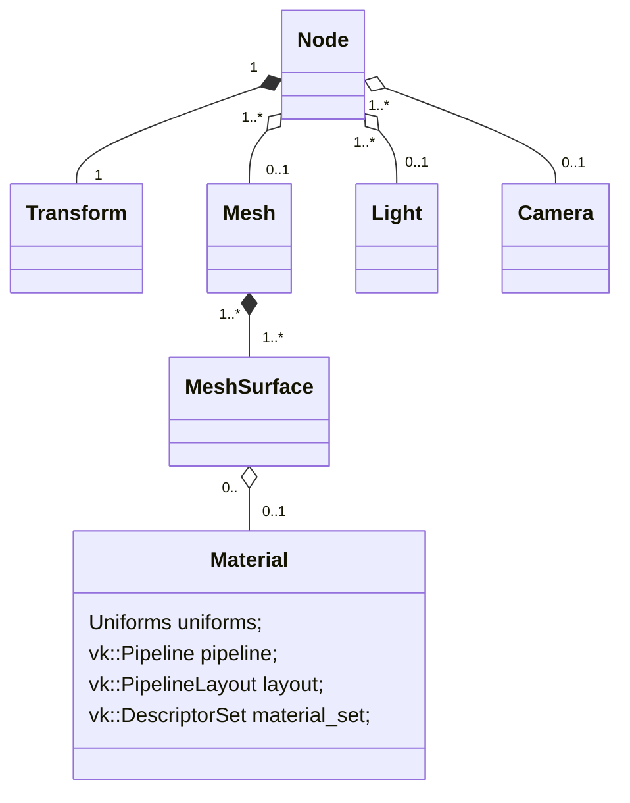

```mermaid
classDiagram
    Node "1" *-- "1" Transform
    Node "1..*" o-- "0..1" Mesh
    Node "1..*" o-- "0..1" Light
    Node "1..*" o-- "0..1" Camera
    Mesh "1..*" *-- "1..*" MeshSurface
    MeshSurface "0.." o-- "0..1" Material

    class Material {
        Uniforms uniforms;
        vk::Pipeline pipeline;
        vk::PipelineLayout layout;
        vk::DescriptorSet material_set;
    } 
```
