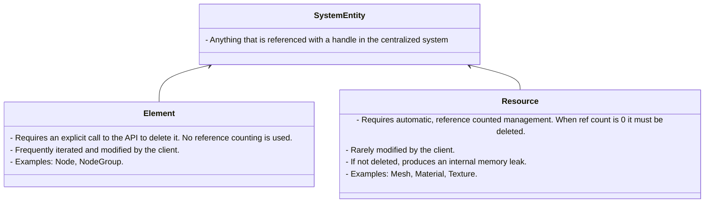

# Architecture Design Record 

## Handles

From [wikipedia](https://en.wikipedia.org/wiki/Handle_(computing)):
> A handle is an abstract reference to a resource that is used when application software references blocks of memory or objects that are managed by another system like a database of an operating system.


In this section, a resource will be anything that referenced by a handle in a centralized system. 

The main difference between pointers and handles is the additional indirection that the handle provides. Resource referenced with a handle can be completely managed externally, for example reallocated if it benefits the system (e.g. the resources might be stored in an array that can be defragmented when necessary). We may say that a handle is more abstract reference than a pointer, which is just a memory address. The handles increase the control that the managing system has over the operations performed on the referent. The examples of handles include:
- OpenGL GLuints, Vulkan handles,
- operating system file descriptors, PIDs, network sockets,
- databases guids.

The problems of dangling pointer and memory leak (resource leak) are also relevant when the handles are used. 

### The dangling handles problem 

To avoid dangling pointers, *tombstones* might be used. In this scenario we always assume that a handle that client has, might no longer be valid. Of course, this introduces additional overhead to the system because we need to query a special array to know if the handle is still valid. The equivalent pointer solution in STL is `std::weak_ptr`, which should be queried with `expired()` if there is no guarantee that the pointer is a dangling pointer. The problem is that this solution depends on the programmer remembering to do such a query so its not safe. 

We could return the `OptionalPtr` that forces a programmer to call `get()` to access the raw pointer and has a `bool()` operator implemented so that it returns false when the raw ptr is null:

```cpp
OptionalPtr<const TextureInfo> TextureAPI::texture_info(TextureHandle handle) {
    auto index = index_of(handle);
    auto version = version_of(handle);
    return reinterpret_cast<const TextureInfo*>(
        uintptr_t(&texture_infos_[index]) * (version_[index] == version)
    );
}
```

This way we force the programmer to always unwrap the result with `get` function which increases the probability that the programmer will think whether they should do a check first:

```cpp
auto api = TextureAPI::init();

// ...

auto texture_handle = api.create(512, 512).or_panic("Fatal Error: Could not create a texture"); 

// ...

// Programmer is not sure if the `texture_handle` is still valid so they wrapped the call in the `if` statement.
if (auto texture_info = api.texture_info(texture_handle)) {
    // do something with the texture info
    auto pixel_count = texture_info.get()->width * texture_info.get()->height * 4;
    // ....
}
```

Imagine that the read call (`texture_info(...)`) happens immediately after the successful `create` call. In this scenario the programmer is 100% sure that the call result is valid and they can call `get()` immediately:

```cpp
auto api = TextureAPI::init();
auto texture_handle = api.create(512, 512).or_panic("Fatal Error: Could not create a texture"); 
auto texture_info = api.texture_info(texture_handle).get();  
```

Also in a scenario when there are more queries associated with the texture handle, the user might reduce the if statements like this:

```cpp
if (api.exists(texture_handle)) {
    auto* info = api.texture_info(texture_handle).get();
    auto* mats = api.texture_material_refs(texture_handle).get();
}
```

Summing up:
- The system is aware of dangling handles and it might be easily queried to check if the handle is valid.
- Every query checks for the handle validity and behaves accordingly. We pay with overhead for safety.
- Every read query returns optional pointer. The signature and the unwrap (`get()`) necessity force the client to think if they must check whether the resource exist.

### The resource leak problem

Imagine the following code:

```cpp
auto api = TextureAPI::init();
{
    auto texture_handle = api.create(512, 512).or_panic("Fatal Error: Could not create a texture"); 
} // oops
```

After `}` we end up with an *internal memory leak*, because it's impossible to call the `void remove(TextureHandle handle)` function as the client has no handle to call it. This way we might end up with a growing RAM usage to the point when there is no more RAM.

For some resources like nodes in 3D modeller application, where we design a centralized system for nodes management, it's not an issue. In this scenario all of the nodes that are typically stored on the API side are frequently iterated so the client has an opportunity to access their handles.

However, when dealing with resources like textures, materials or shaders, the system must provide an automatic resource management. We use the same solutions that STL already provides for pointers -- RAII and reference counting. The system might include the reference count array and wrappers:

```cpp
class UniqueTexture {
    // move constructor/assignment and destructor impl
private:
    TextureHandle handle;
    TextureAPI* api;
};

class TextureRef {
    // copy/move constructor/assignment and destructor impl
private:
    TextureHandle handle;
    TextureAPI* api;
};

class TextureAPI {
    // ...
    TextureHandle create();
    UniqueTexture create_unique();
    TextureRef create_refc();
};
```

To avoid boiler plate we might use the templates.

## Error handling 

Let's imagine the following API:

```cpp
struct TextureHandle {
    //...
};

struct TextureInfo {
    size_t width;
    size_t height;
    //...
};


// API with CRUD operations
class TextureAPI {
    TextureHandle create();
    OptionalRef<const TextureInfo> info(TextureHandle handle);
    void resize(TextureHandle handle, size_t width, size_t height);
    void remove(TextureHandle handle);
};
```

When working with such an API we might encounter the following 3 types of runtime errors (inspired by [rust error handling guidelines](https://doc.rust-lang.org/book/ch09-00-error-handling.html)):

- *unrecoverable*:
    - *invariants not met error*, e.g. when resizing the texture, the TextureHandle is not properly decoded and the internal call fails.

- *recoverable*:
    - *external errors*, e.g. when creating a texture OpenGL failed, because there is no more space.
    - *compatibility errors*, e.g. the client requests a floating-point texture format but the GPU/driver does not support it.
    - *transient state errors*, e.g. resizing a texture that is currently bound to a framebuffer, which is disallowed until it’s unbound.
    - *logic errors*, e.g. user wants a node to become its own child, this kind of errors are recoverable

For the *recoverable* errors I use the `std::unexpected` which is a C++  equivalent of Rust `Result`. There are 2 other approaches:
- global `get_error` function, that allows to check if any previous API call failed,
- exceptions.

The reason why I decided to use `std::unexpected` is the fact that it explicitly marks the function in its signature that it might fail. In some APIs you would see `std::unexpected` that might contain a subset of errors, which is even more explicit, as the client knows from such a type what could possibly go wrong when they call the function. The problem is that it makes the error propagation more difficult and thus I decided to always return `Error` type that contains all possible errors that might happen it the module (namespace). When the client wants to handle some specific errors they must read the documentation. They might also just stop the program execution if any errors are encountered but they have a choice.

The *unrecoverable* errors are undefined behaviors in the release mode, and are detected with `assert` in the debug mode.

## Data-driven centralized system architecture

In mine architecture, a *system entity* is anything that is referenced with a handle within a centralized system. There are two types of entities that differ from each other due to their different lifetime management. These are *elements* and *resources*, see the graph below:



The distinction is heavily inspired by Godot. Each `Node` consists of *components* (similar to ECS). Components are not referenced with Id. They are associated only with the `NodeId` that they were assigned to. `NodeGroup` allows to create an iterable container for nodes.

### Scene system 

<!-- ```mermaid
classDiagram
    Node "1" *-- "1" Transform
    Node "1..*" o-- "0..1" Mesh
    Node "1..*" o-- "0..1" Light
    Node "1..*" o-- "0..1" Camera
    Mesh "1..*" *-- "1..*" MeshSurface
    MeshSurface "0.." o-- "0..1" Material

    class Material {
        Uniforms uniforms;
        vk::Pipeline pipeline;
        vk::PipelineLayout layout;
        vk::DescriptorSet material_set;
    } 
``` -->
